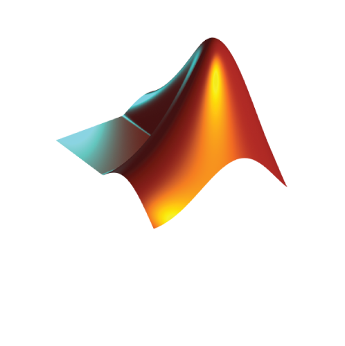

```{r setup, include=FALSE}
knitr::opts_chunk$set(echo = TRUE)
```

## Data Science Collaboration

<div class='col2'>

<br><br>

</div>

## Statistical Modeling {data-background='img/priorLikePosterior.png' data-state='opac50'}

<br>
<br>
<br>

<p style="font-size:200%">

$$y \sim \mathscr{N}(X\beta, \sigma^2)$$
</p>


## Modeling Specialties {data-background='img/ml3.png'}

<p style="text-align:center; font-size: 100%">
Mixed models<br>
Machine learning<br>
High dimensional data<br>
Code optimization<br>
Text analysis<br>
Analysis of complex sample surveys <br>
GIS, spatial, remote-sensing<br>
and more!
</p>


## Programming Expertise {data-background='img/Rlogo.svg' data-state='opac75'}

<p style="text-align:center; font-size: 100%">
R<br>
Python<br>
Matlab<br>
Stan<br>
Stata<br>
Go<br>
and more!
</p>


## Statistical <br>and<br> Computational Programming


<br>


## Other Assistance {data-background='img/plotly_scatter.png' data-state='opac75'}


<p style="text-align:center;">
Visualization <br>
Web scraping <br>
Data I/O <br>
Concept formation <br>
Reproducible research <br>
Best practices
</p>

## {data-background='img/q_white.png' data-state='opac25'}

<p style="text-align:center;">
For common data and analysis problems, just stop by!
<br><br>
Send a question to the help list!
</p>
<br>

<p style="text-align:center; font-size:65%">
stats-consulting@umich.edu &nbsp; ds-consulting@umich.edu  &nbsp;  &nbsp; hpc-consulting@umich.edu
</p>

## Workshops {data-background='img/code2.png'}


<p style="text-align:center; font-size: 120%">
<br>Hands on programming<br><br>
Data Science Skill Series</p>

<br><br>

<p style="text-align:center; font-size: 75%">
[cscar.research.umich.edu/events](cscar.research.umich.edu/events)
</p>

## {data-transition="zoom"  data-autoslide="3000"}


##  {data-transition="zoom" data-autoslide="3000" }


## {data-transition="zoom"  data-autoslide="2000"}


##  {data-transition="zoom" data-autoslide="2000" }


## {data-transition="zoom"  data-autoslide="1000"}


##  {data-transition="zoom" data-autoslide="1000" }


## {data-transition="zoom"  data-autoslide="500"}


##  {data-transition="zoom" data-autoslide="500" }


## {data-transition="zoom"  data-autoslide="250"}


##  {data-transition="zoom" data-autoslide="250" }


## {data-transition="zoom"  data-autoslide="125"}


##  {data-transition="zoom" data-autoslide="125" }



<!-- ## {data-transition="zoom"  data-autoslide="125"} -->

<!--  -->


<!-- ##  {data-transition="zoom" data-autoslide="125" } -->

<!--  -->

<!-- ## {data-transition="zoom"  data-autoslide="125"} -->

<!--  -->


<!-- ##  {data-transition="zoom" data-autoslide="125" } -->

<!--  -->


<!-- subliminal here -->

## {data-transition="zoom"  data-autoslide="125"}


## {data-transition="zoom"  data-autoslide="125"}


##  {data-transition="zoom" data-autoslide="125" }


## {data-transition="zoom"  data-autoslide="125"}


## {data-transition="zoom"  data-autoslide="125"}


## {data-transition="zoom"  data-autoslide="125"}


##  {data-transition="zoom" data-autoslide="125" }


## {data-transition="zoom"  data-autoslide="125"}


## {data-transition="zoom"  data-autoslide="125"}


## {data-transition="zoom"  data-autoslide="125"}


## {data-transition="zoom"  data-autoslide="125"}


##  {data-transition="zoom" data-autoslide="125" }


## {data-transition="zoom"  data-autoslide="125"}


## {data-transition="zoom"  data-autoslide="125"}


## {data-transition="zoom"  data-autoslide="125"}


##  {data-transition="zoom" data-autoslide="125" }


## {data-transition="zoom"  data-autoslide="125"}


## {data-transition="zoom"  data-autoslide="125"}


## {data-transition="zoom"  data-autoslide="125"}


##  {data-transition="zoom" data-autoslide="125" }


## {data-transition="zoom"  data-autoslide="125"}


## {data-transition="zoom" data-background="img/sunshine.jpg"  data-autoslide="3000"}


<div style="text-align:center; font-size:200%">Data Science Serenity</div>


## Join Us Now! {data-transition="zoom" data-autoslide="3000" }

<p class='fragment fade-up' style="text-align:center; font-size:200%"> Can you do any less?!</p>


## {data-background="img/cscar84.png" data-state='opac50'}